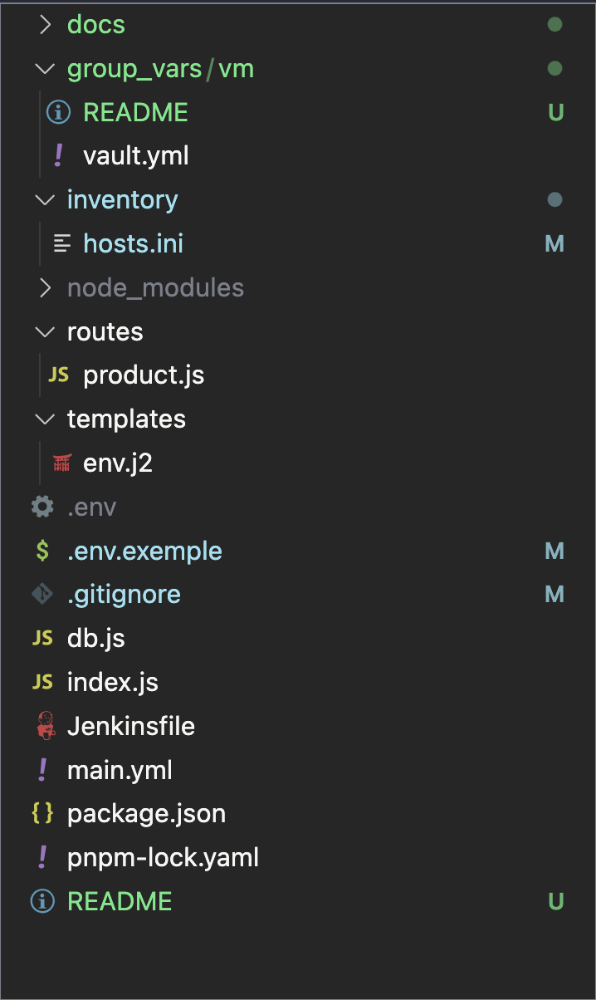
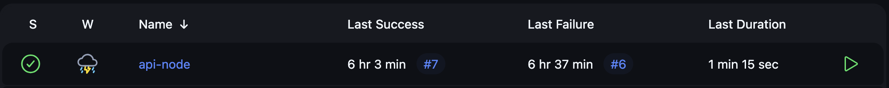
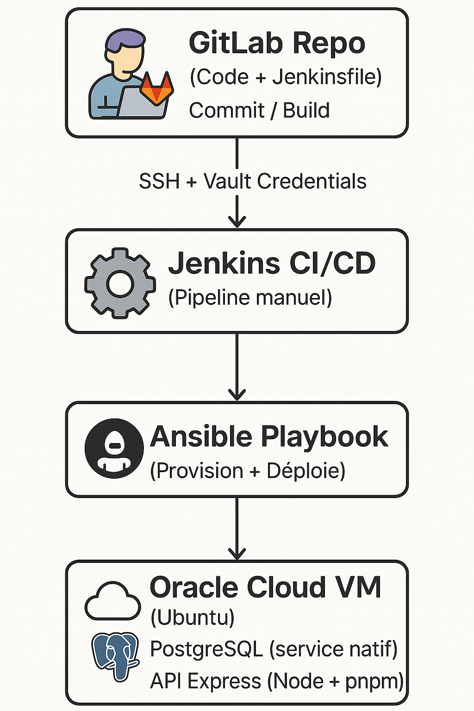

# 🚀 Déploiement automatisé d’une API Express + PostgreSQL 

### (Ansible • Jenkins • GitLab • Oracle Cloud)

**Objectif :** automatiser totalement le déploiement d’une API Node.js (Express) connectée à une base PostgreSQL, sur une VM Ubuntu hébergée chez Oracle Cloud, à l’aide d’un pipeline CI/CD complet.

---

## 🧭 Vue d’ensemble

Ce projet illustre comment j’ai mis en place un **pipeline d’intégration et de déploiement continu (CI/CD)** alliant :
- **GitLab** pour la gestion du code source  
- **Jenkins** pour l’orchestration du pipeline  
- **Ansible** pour le provisioning et le déploiement sur le serveur  
- **Vault** pour le chiffrement des secrets  
- **Oracle Cloud (VM Ubuntu)** pour l’hébergement de l’API et de la base

---


**Points clés :**

* Le **déploiement se déclenche manuellement** dans Jenkins (choix volontaire : certains clients préfèrent contrôler le “go” en prod).
* Le mot de passe **Vault** est fourni depuis les **Credentials Jenkins**.
* PostgreSQL fonctionne comme un **service système**, pas dans un conteneur Docker.
* L’API Express tourne en tâche de fond (`nohup pnpm start`) et écrit ses logs dans `/opt/api/api.log`.

---

## 🖼️ Illustrations

* **Structure du dépôt**

<p align="center">
  
</p>

* **Job Jenkins (succès / échec / durée)**

  

* **Architecture globale**

  <p align="center">
  
</p>

---

## ⚙️ Fonctionnement du pipeline

### 🧱 Jenkinsfile

> Exemple simplifié (identifiants anonymisés)

```groovy
pipeline {
  agent any

  stages {
    stage('Checkout') {
      steps {
        git url: '<GIT_REPO_URL>',
            branch: 'main',
            credentialsId: '<JENKINS_GIT_CREDENTIALS_ID>'
      }
    }

    stage('Run Ansible') {
      steps {
        sshagent(credentials: ['<ANSIBLE_HOST_KEY_ID>']) {
          withCredentials([string(credentialsId: '<ANSIBLE_VAULT_PASS_ID>', variable: 'VAULT_PASS')]) {
            sh '''
              set -euo pipefail
              export ANSIBLE_HOST_KEY_CHECKING=False

              echo "=== Lancement du playbook Ansible ==="
              ansible --version

              VAULT_FILE="$(mktemp)"
              printf "%s" "$VAULT_PASS" > "$VAULT_FILE"

              ansible-playbook -i inventory/hosts.ini main.yml --vault-password-file "$VAULT_FILE"

              rm -f "$VAULT_FILE"
            '''
          }
        }
      }
    }
  }

  post {
    success { echo '✅ Déploiement réussi !' }
    failure { echo '❌ Échec du déploiement !' }
  }
}
```

---

## 📜 Playbook Ansible (résumé)

Le playbook `main.yml` :

* Met à jour les paquets système et installe **Node.js, pnpm, PostgreSQL**
* Crée les **utilisateurs système** (`apiuser`, `postgres`) et les répertoires nécessaires
* Configure **PostgreSQL** (`pg_hba.conf`, `postgresql.conf`) pour l’accès local sécurisé
* Crée la **base**, la **table `products`**, et insère des **données de démo**
* Clone le dépôt API dans `/opt/api` et installe les dépendances via `pnpm install`
* Génère un fichier **`.env`** depuis un **template Jinja** (`templates/env.j2`)
* Lance l’API en tâche de fond et affiche les **20 dernières lignes du log**

Les secrets (`vault_db_user`, `vault_db_password`, `vault_db_name`) sont stockés dans **Vault** (`group_vars/vm/vault.yml`) et **jamais en clair**.

---

## 🔌 API Express

* **Port :** `3000`
* **Endpoints principaux :**

  * `GET /` → message de bienvenue
  * `GET /product` → renvoie les produits depuis PostgreSQL
* **Connexion DB :** fichier `db.js` (via `pg`)

> Exemple de retour :

```json
[
  { "id": 1, "name": "Café", "price_cents": 250 },
  { "id": 2, "name": "Croissant", "price_cents": 180 },
  { "id": 3, "name": "Sandwich", "price_cents": 550 }
]
```

---

## 🧠 Sécurité et bonnes pratiques

* 🔐 **Vault** pour le chiffrement des variables sensibles
* 🔑 **Jenkins Credentials** pour gérer les clés SSH et mots de passe
* 🧱 **Ansible idempotent** : rejouable sans casser l’existant
* 🧍‍♂️ **Utilisateurs dédiés** (`apiuser`, `postgres`)
* 🧩 **PostgreSQL** écoutant uniquement sur `127.0.0.1`
* 🗂️ **Structure propre** et documentée pour la maintenance

---

## 💡 Résultats

* ✅ Déploiement **en 1 clic** depuis Jenkins
* ✅ Configuration **automatisée et reproductible**
* ✅ Aucun secret stocké en clair
* ✅ Pipeline adaptable pour d’autres environnements (préprod / prod)

---

## 💼 Expertise démontrée

* Mise en œuvre d’un pipeline CI/CD complet (**GitLab → Jenkins → Ansible**) assurant un déploiement automatisé et maîtrisé  
* Installation et configuration complète du serveur Ubuntu sur **Oracle Cloud**, incluant l’installation de **Jenkins via Docker** et la mise en place de l’environnement système  
* Gestion sécurisée des secrets et variables via **Vault** et **Jenkins Credentials**  
* Déploiement de l’API Node.js (Express) et de **PostgreSQL** sur un environnement entièrement provisionné par **Ansible**  
* Rédaction d’une documentation technique claire, destinée aux **équipes projets et clients** pour assurer la maintenabilité et la reproductibilité


---

## 📂 Pour tester localement

```bash
pnpm i
pnpm start
# ou npm start

# Test des endpoints :
curl http://127.0.0.1:3000/
curl http://127.0.0.1:3000/product
```

**`.env.example`**

```dotenv
DB_HOST=127.0.0.1
DB_PORT=5432
DB_USER=<DB_USER>
DB_PASSWORD=<DB_PASSWORD>
DB_NAME=<DB_NAME>
PORT=3000
HOST=127.0.0.1
```

---

## 🔗 Liens

* **Auteur :** [Haris](https://github.com/bennirahh)
* **Portfolio :** [Présent] (https://www.harisbenlamri.me/)
* **Repo GitLab (prod réel)** : sur demande

> ℹ️ Ce dépôt est une **vitrine** : certaines valeurs sont volontairement anonymisées (`<PLACEHOLDER>`).
> Le déploiement réel s’effectue via le pipeline GitLab + Jenkins en production.

---

### 🏁 Stack

`Express` · `PostgreSQL` · `Ansible` · `Jenkins` · `GitLab` · `Oracle Cloud` · `Vault` · `pnpm` · `Docker`

---
[](https://github.com/bennirahh/devops-api-deploy/stargazers)
[](https://github.com/bennirahh/devops-api-deploy/issues)
[](https://github.com/bennirahh/devops-api-deploy/commits/main)
[](LICENSE)
